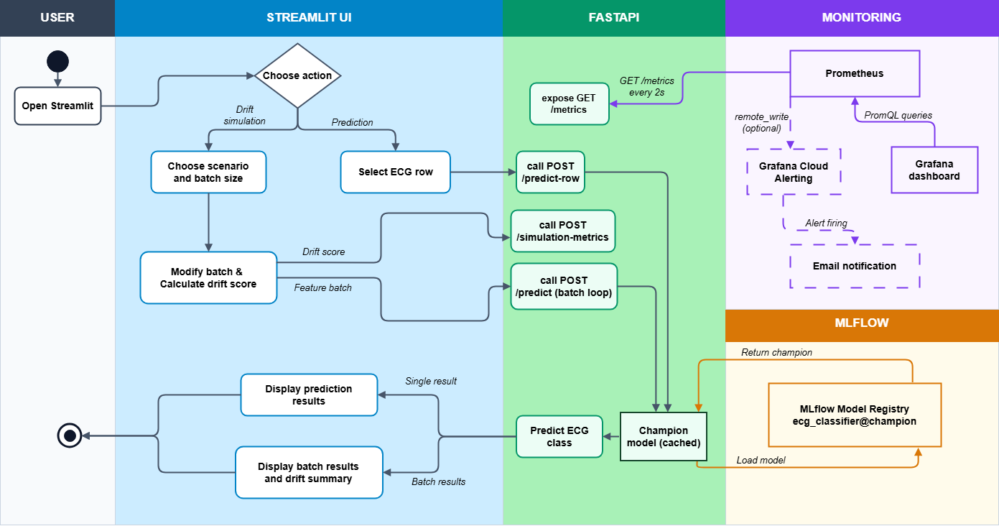
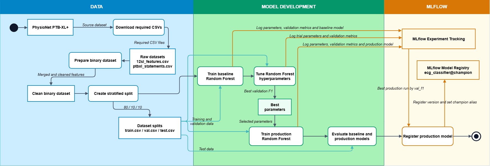
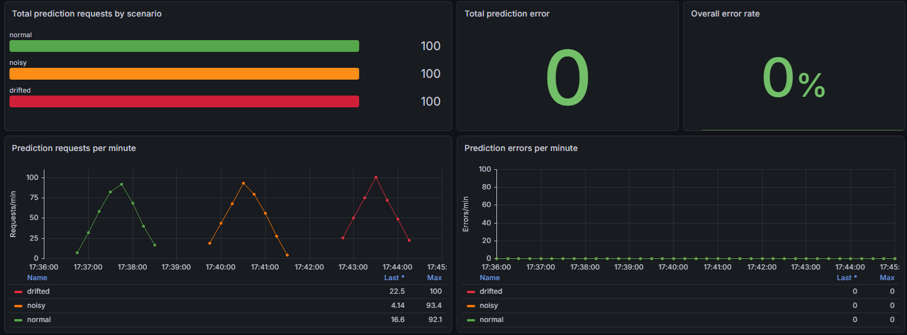
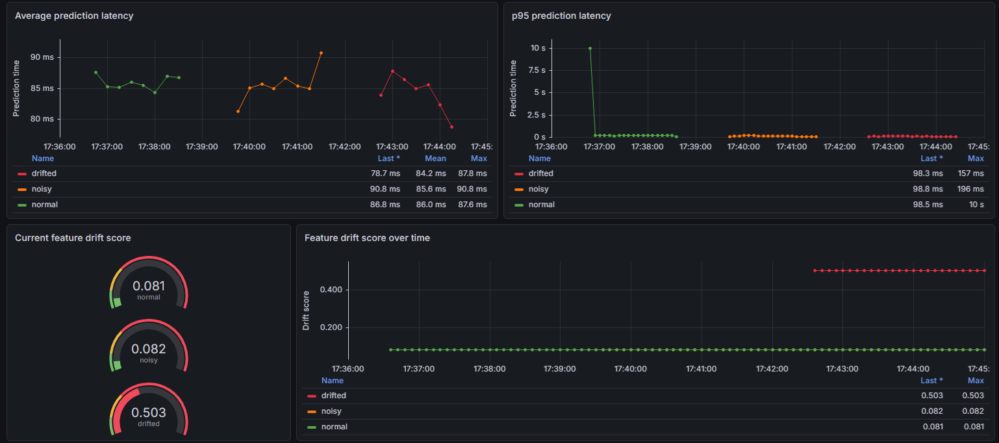
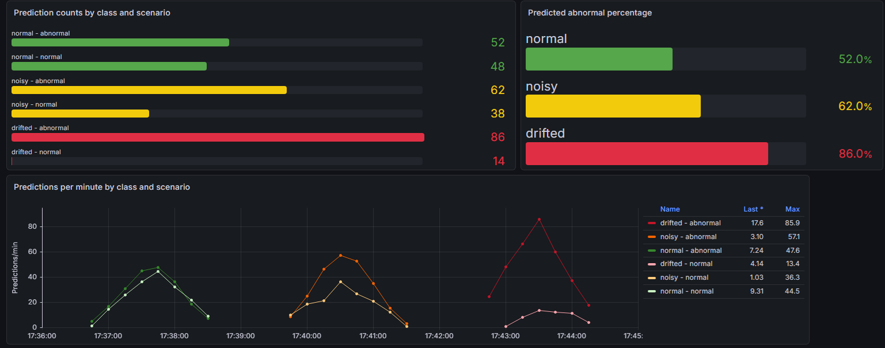
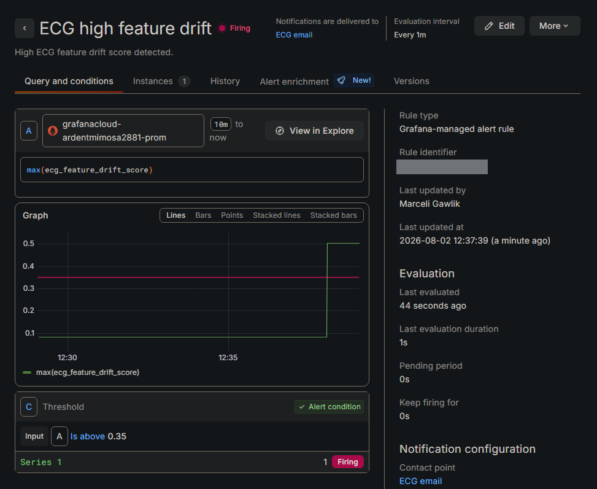

# ECG Classification and Monitoring Platform

A portfolio-focused MLOps project for binary ECG classification (`normal` / `abnormal`) using Python, scikit-learn and PTB-XL+ features.

The main goal was not to focus on finding the best model for the ECG classification task, but to design and implement an end-to-end ML platform focused on MLOps and DevOps concepts such as reproducible data and training pipelines, experiment tracking, model registry, API serving, monitoring, drift simulation and alerting.

## MLOps Highlights

* Reproducible pipeline for data download, preparation, stratified splitting, baseline training, hyperparameter tuning, production training, evaluation and registration
* MLflow Experiment Tracking and Model Registry with the production alias `ecg_classifier@champion`
* FastAPI model serving with a cached champion model and Prometheus metrics exposed through `/metrics`
* Streamlit interface for individual predictions, batch drift simulation and links to monitoring tools
* Prometheus and Grafana monitoring for traffic, errors, latency, prediction distribution and feature drift
* Optional Grafana Cloud `remote_write` setup with an email alert for high drift
* Docker Compose environment with a multi-stage Dockerfile and a non-root runtime user
* Pytest and HTTPX integration tests with GitHub Actions CI

## Data Source

The project uses [PTB-XL+ v1.0.1 from PhysioNet](https://physionet.org/content/ptb-xl-plus/1.0.1/) (accessed 2026-08-07).

Only `12sl_features.csv` and `ptbxl_statements.csv` are downloaded. Source and generated CSV files are not stored in the repository.

## Architecture
The diagrams below illustrate the overall system architecture and the end-to-end ML pipeline implemented in this project.

### System architecture



### ML pipeline



The application consists of the following services running in separate Docker containers:

| Service | Image | Port |
|---|---|---:|
| MLflow | `ecg-ml` | `5000` |
| FastAPI | `ecg-ml` | `8000` |
| Streamlit | `ecg-ml` | `8501` |
| Prometheus | `prom/prometheus:latest` | `9090` |
| Grafana | `grafana/grafana:latest` | `3000` |

`ecg-ml` is built from the multi-stage `Dockerfile` and serves as the base image for the MLflow, FastAPI and Streamlit services.

## Monitoring and Drift

FastAPI exposes the following Prometheus metrics:

* `ecg_prediction_requests_total`
* `ecg_prediction_errors_total`
* `ecg_prediction_latency_seconds`
* `ecg_prediction_class_total`
* `ecg_feature_drift_score`


### Local Grafana dashboard

The provisioned Grafana dashboard uses PromQL to monitor request volume, error rate, average and p95 latency, prediction classes, predicted abnormal percentage and feature drift.



The first view summarizes the total number of prediction requests and errors for each scenario, together with how request and error rates changed over time.



At the beginning, the p95 latency reached approximately 10 seconds, meaning that the slowest 5% of requests in that period took around 10 seconds or longer. This was likely caused by the first request loading the model from the MLflow Model Registry. Later requests were much faster because the cached model did not need to be loaded again for every request.

The drifted scenario also produced a clear increase in drift score because feature means were deliberately shifted away from the training reference. The noise and drift simulation logic is described on the Streamlit home page and in `app/tabs/home.py`.



The synthetic stress test shows that shifting feature values changed the model prediction distribution and created a clear majority of abnormal predictions. This shows that the model reacts strongly to data that differs from the training data.

For the noisy scenario, the drift score remained almost unchanged, while predictions still shifted toward the abnormal class. The current drift score mainly measures changes in feature means, so it is less sensitive to changes in data spread. A more complete drift analysis could include additional distribution-based metrics.

#### Dashboard - final observations

The drifted scenario moved many features strongly in one direction. The resulting prediction imbalance may therefore come from unusual or potentially unrealistic feature combinations. The experiment demonstrates sensitivity to a strong synthetic shift, but it does not prove that the model would perform poorly on completely new real-world data.

A higher drift score or a change in prediction distribution does not automatically mean that the model should be retrained. Before making that decision, its performance should also be evaluated using real, labeled data collected from the new environment.

### Grafana Cloud drift alert

The optional Grafana Cloud configuration sends `ecg_feature_drift_score` through Prometheus `remote_write`. An email notification is triggered when the score exceeds `0.35`.



## Available Pages and API Routes

### Pages

* **Streamlit:** `http://localhost:8501`
* **MLflow:** `http://localhost:5000`
* **Prometheus:** `http://localhost:9090`
* **Grafana:** `http://localhost:3000`

### API Routes

* **Swagger documentation**

_GET /docs_ - opens FastAPI Swagger UI.

`http://localhost:8000/docs`

* **Health check**

_GET /health_ - checks whether the API is running.

`http://localhost:8000/health`

Example response:

```json
{
  "status": "ok"
}
```

* **Model information**

_GET /model-info_ - returns information about the loaded champion model.

`http://localhost:8000/model-info`

Example response:

```json
{
  "model_uri": "models:/ecg_classifier@champion",
  "model_type": "RandomForestClassifier",
  "feature_count": 776
}
```

* **Predict one test row**

_POST /predict-row_ - loads one row from `test.csv` and returns the prediction.

`http://localhost:8000/predict-row`

Example body:

```json
{
  "row_index": 0
}
```

* **Prediction for drift simulation**

_POST /predict_ - works similarly to `/predict-row`, but it receives ECG features that have already been modified by the selected drift scenario. This makes it possible to compare how normal, noisy and drifted data affect the model predictions.

`http://localhost:8000/predict`

Example body:

```json
{
  "features": {
    "P_Area_I": 0.0,
    "P_PeakTime_I": 0.0,
    "Q_Area_I": 0.0
  },
  "scenario": "normal"
}
```

The `features` object must contain every feature listed in `models/production/features.json`.

* **Publish simulation drift score**

_POST /simulation-metrics_ - updates the Prometheus drift gauge for a selected scenario.

`http://localhost:8000/simulation-metrics`

Example body:

```json
{
  "scenario": "drifted",
  "drift_score": 0.5
}
```

* **Prometheus metrics**

_GET /metrics_ - exposes API and drift metrics in the Prometheus text format.

`http://localhost:8000/metrics`

## How to Run

The source CSV files are mounted into the containers at runtime, so they are not required to build the `ecg-ml` image.

### Makefile

Build the `ecg-ml` image and start all Docker Compose services:

```bash
make up
```

Then run the complete ML pipeline:

```bash
make full-pipeline
```

The pipeline first downloads the two required CSV files if they are missing, then prepares the data, trains and evaluates the models, and registers `ecg_classifier@champion` in MLflow.

### Windows PowerShell

The PowerShell script performs the complete setup, including data download, Docker Compose startup and the ML pipeline:

```powershell
.\run_ml_pipeline.ps1
```

The CSV download does not need to be run separately.

To stop all containers:

```bash
make down
```

## Tests and CI

The integration tests use Pytest and HTTPX to check:

* API health
* champion model availability
* a real prediction through `/predict-row`

Run locally:

```bash
pytest tests -v
```

GitHub Actions CI runs after each push or pull request. It downloads the required CSV files, builds and starts the environment, executes the pipeline and runs the integration tests.

The current implementation covers continuous integration only.
